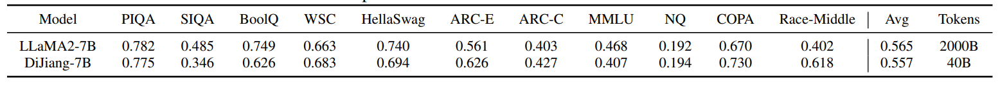

# DiJiang: Efficient Large Language Models through Compact Kernelization

<p align="left">
<a href="https://arxiv.org/abs/2403.19928" alt="arXiv">
    </a>
</p>


This is the official implementation of ["DiJiang: Efficient Large Language Models through Compact Kernelization"](https://arxiv.org/abs/2403.19928), a novel Frequency Domain Kernelization approach to linear attention. DiJiang is a mythical monster in Chinese tradition. It has six legs and four wings , and it is known for its capability to move quickly.


🚀 In our work "DiJiang", we propose a fast linear attention approach that leverages the power of **Fast Discrete Cosine Transform (Fast DCT).** Theoretical analyses and extensive experiments demonstrate the speed advantage of our method.





## Training

### Preparation

- Download Dataset: We utilized the Pile dataset for training [The Pile: An 800GB Dataset of Diverse Text for Language Modeling (arxiv.org)](https://arxiv.org/abs/2101.00027)
- Check CUDA version: suggested cuda>=11.7

- Install required packages: ```pip install -r requirements.txt```

- Download pre=trained model weights (i.e. ```pytorch_model.bin``` files in the original HuggingFace models) and place them in the corresponding DiJiang model folder (```e.g. modeling/pythia-70M-dijiang```).

Links of pre-trained weights:

```
# Pythia-70M
https://huggingface.co/EleutherAI/pythia-70m/resolve/main/pytorch_model.bin?download=true

# Pythia-160M
https://huggingface.co/EleutherAI/pythia-160m/resolve/main/pytorch_model.bin?download=true

# Pythia-410M
https://huggingface.co/EleutherAI/pythia-410m/resolve/main/pytorch_model.bin?download=true

# Pythia-1B
https://huggingface.co/EleutherAI/pythia-1b/resolve/main/pytorch_model.bin?download=true

# Pythia-2.8B
https://huggingface.co/EleutherAI/pythia-2.8b/resolve/main/pytorch_model.bin?download=true

```

### Running

A training shell is provided at ```bash run_dijiang.sh``` for your reference.

Important arguments to take care of:

```

    --model_name_or_path <path to the HuggingFace model>
    --dataset_dir <path to the original PILE dataset>
    --data_cache_dir <path to the cached dataset (if cached); cache stored at this dir>
    --per_device_train_batch_size <global_batchsize // device_count>
    --output_dir <dir to store the trained model>
    --logging_dir <dir to store tensorboard>

```

## Future work (Stay Tuned!)
- [x] Training code for **DiJiang**
- [ ] Better inference code
- [ ] Inference models

## Citation (in BibTex)

```
@misc{chen2024dijiang,
      title={DiJiang: Efficient Large Language Models through Compact Kernelization}, 
      author={Hanting Chen and Zhicheng Liu and Xutao Wang and Yuchuan Tian and Yunhe Wang},
      year={2024},
      eprint={2403.19928},
      archivePrefix={arXiv},
      primaryClass={cs.CL}
}
```

## Acknowledgement

We acknowledge the authors of the following repos:

[DenseSSM (github)](https://github.com/WailordHe/DenseSSM)

[Llama2 (huggingface.co)](https://huggingface.co/docs/transformers/main/model_doc/llama2#usage-tips)

[Pythia (EleutherAI)](https://huggingface.co/docs/transformers/main/model_doc/llama2#usage-tips)

[RetNet (Microsoft)](https://github.com/microsoft/torchscale/tree/main)

[Transformersscale (Microsoft)](https://github.com/microsoft/transformersscale/tree/main)

[Stanford Alpaca (Stanford)](https://github.com/tatsu-lab/stanford_alpaca)

[Chinese-LLaMA-Alpaca (ymcui)](https://github.com/ymcui/Chinese-LLaMA-Alpaca)
